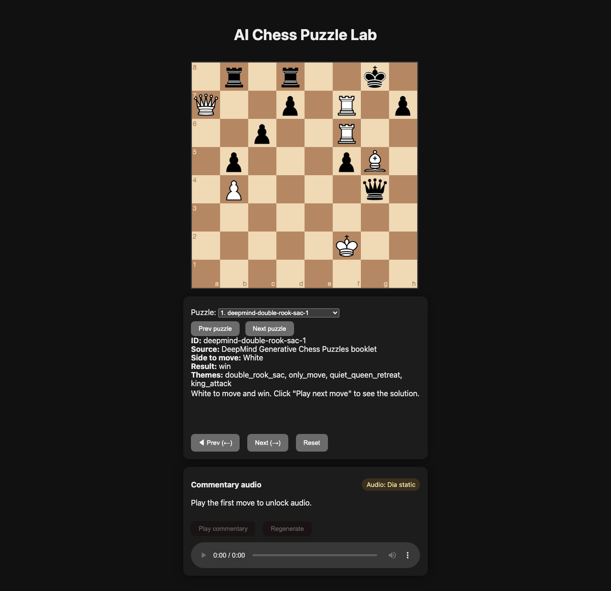

# AI Chess Puzzle Lab



Chess puzzle viewer + TTS-ready pipeline built from the DeepMind “Generating Creative Chess Puzzles” paper and the Gotham video. Features multiple curated puzzles (DeepMind double rook sac + paper appendix mates), per-move commentary, keyboard navigation, and optional narrated audio (Dia, gTTS, or your own TTS).

## Live Demo

Hosted on GitHub Pages (static only):  
https://toddllm.github.io/ai-chess-puzzle-lab/  
Audio buttons are disabled on the static site because there is no backend—run locally with the Flask server to enable speech.

## Running Locally (static/silent)

1. Clone the repo.
2. Serve the files, e.g.:
   ```bash
   python -m http.server 8010
   ```
3. Open http://localhost:8010

## Running Locally with TTS

We ship a lightweight Flask backend (`server.py`) that serves the static files and generates commentary audio on demand.

- Engines:
  - `--tts-engine dia` to use the Dia model (install from sibling repo: `pip install -e ../dia`; requires torch)
  - `--tts-engine gtts` (default) for a lightweight network TTS
  - `--tts-engine dummy` for tone placeholders

Quick start:
```bash
python -m pip install -r requirements-dev.txt
python -m playwright install chromium  # first run only, for smoke tests
python server.py --port 8010 --tts-engine gtts
# open http://localhost:8010
```

Pre-generated Dia clips (if present) live under `audio/` with `audio_manifest.json`. Newly generated clips land in `generated_audio/`.

## Controls

- Puzzle selector: dropdown or Up/Down arrows to switch puzzles.
- Move navigation: Next/Prev buttons or Arrow Right/Arrow Left to step through moves.
- Commentary updates per move; Reset returns to the starting position.
- Audio buttons (when backend enabled): play/regenerate per-move commentary.

## Puzzle Data

- Puzzles live in `puzzles.json` (FEN, SAN lines, themes, commentary).
- Current content: the DeepMind double-rook-sac puzzle plus six mate-in-2s from the DeepMind paper appendix.

## TTS Pipeline (offline generation)

- `generate_moves.py` builds per-move prompts, dummy audio (silence), and a manifest. Plug in your TTS where noted.
- Sample input: `sample_moves_double_rook_sac.json` (TTS-friendly, spelled-out commentary).
- Usage:
  ```bash
  python generate_moves.py --game-id double_rook_sac --moves sample_moves_double_rook_sac.json --out generated/
  ```
- Replace the placeholder TTS call in `generate_moves.py` with your model; files land in `generated/<game_id>/` with `manifest.json`.

## Rebuild Dia audio locally

If you want to recreate the shipped Dia clips (or refresh them after editing `puzzles.json`):
```bash
source .venv/bin/activate
pip install -e ../dia --no-deps  # if not already
python generate_dia_audio.py     # writes to audio/ and audio_manifest.json
```

The script uses Dia on CPU/GPU (prefers CUDA if available) and normalizes output audio. Regenerated clips can be served directly by the static site or the Flask server.

## Smoke Test (Playwright + Whisper)

The `tests/smoke_playwright_whisper.py` script (if present):
- starts the Flask server (headless)
- steps through puzzles with Playwright (chromium, headless)
- downloads generated audio clips and transcribes them with Whisper
- asserts key phrases and writes a summary to `playwright_runs/smoke_summary.json`

Run locally:
```bash
python -m pip install -r requirements-dev.txt
python -m playwright install chromium
python tests/smoke_playwright_whisper.py --engine gtts --port 8010
```
Switch `--engine dia` to smoke test the Dia backend instead.

## Development Notes

- Frontend is plain HTML/JS with `chess.js` and `chessboard.js` from CDN.
- `server.py` is a tiny Flask wrapper that adds `/api/tts` to the static bundle.
- Playwright (chromium) + Whisper are used for optional headless smoke tests.
